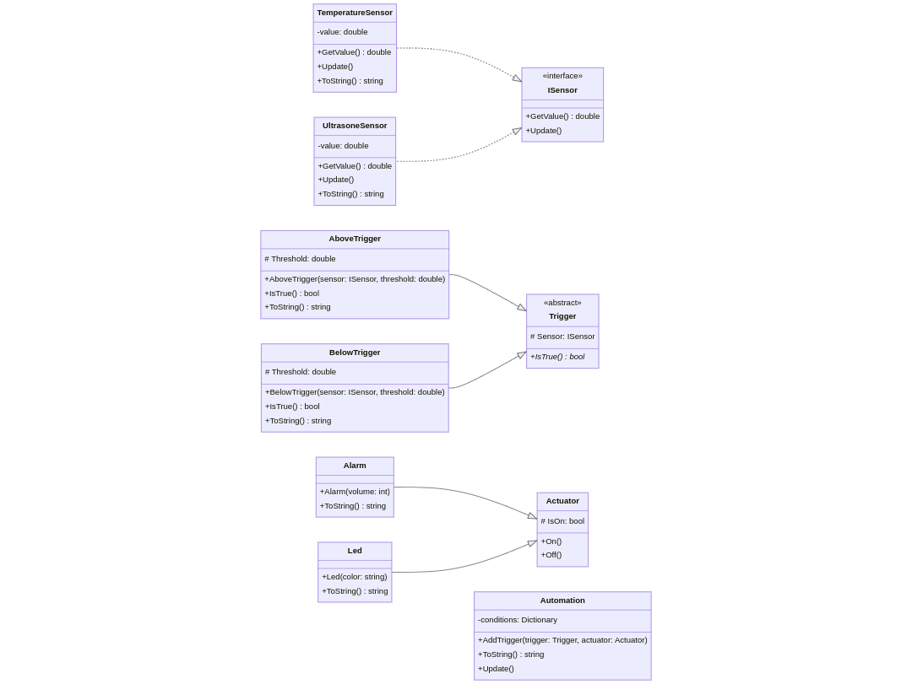

# Sensoring Guard

A bit of a Home Assistant like setup that serves as an automation application.

It has:

* Sensors: to emulate hardware sensors such as temperature sensor
* Actuators: to emulate hardware actuators such as a pump
* Triggers: abstractions that allow us to model conditions
* Automations: allow us to monitor sensors and act using actuators

This was an in-class challenge where I drew out the whole system together with the students. We basically started of with two use-cases:

1. We have a temperature sensors that monitors something and if it goes above a temperature, an alarm should sound.
2. We have a well in the garden and if the water level drops below a threshold, an LED should turn on.

## UML Diagram

Below is the basic diagram of this project. Note that not all classes are included, just the ones that are required to get the bigger picture.

