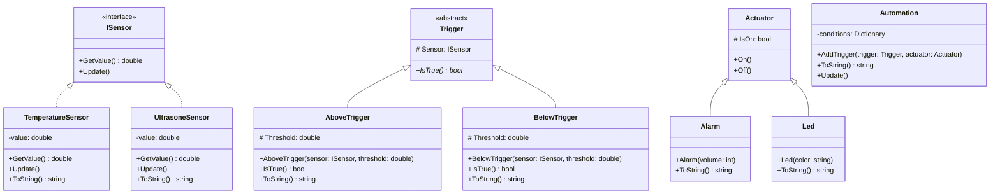

```mermaid
classDiagram
    ISensor <|.. TemperatureSensor
    ISensor <|.. UltrasoneSensor
    class ISensor{
        <<interface>> 
        +GetValue() double
        +Update()
    }
    class TemperatureSensor{
        +GetValue() double
        +Update()
        +ToString() string
        -value: double
    }
    class UltrasoneSensor{
        +GetValue() double
        +Update()
        +ToString() string
        -value: double
    }

    Trigger <|-- AboveTrigger
    Trigger <|-- BelowTrigger
    class Trigger{
        <<abstract>>
        # Sensor: ISensor
        +IsTrue()* bool
    }
    class AboveTrigger{
        # Threshold: double
        +AboveTrigger(sensor: ISensor, threshold: double)
        +IsTrue() bool
        +ToString() string
    }
    class BelowTrigger{
        # Threshold: double
        +BelowTrigger(sensor: ISensor, threshold: double)
        +IsTrue() bool
        +ToString() string
    }

    Actuator <|-- Alarm
    Actuator <|-- Led
    class Actuator{
        # IsOn: bool
        +On()
        +Off()
    }
    class Alarm{
        +Alarm(volume: int)
        +ToString() string
    }
    class Led{
        +Led(color: string)
        +ToString() string
    }

    class Automation{
        +AddTrigger(trigger: Trigger, actuator: Actuator)
        +ToString() string
        +Update()
        -conditions: Dictionary<Trigger,Actuator>
    }
```